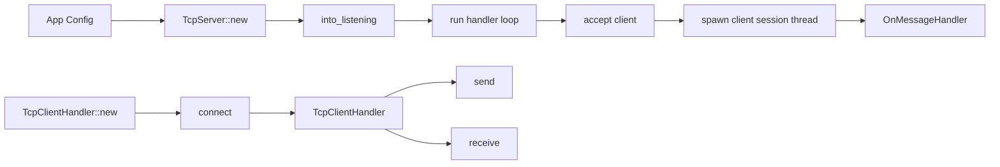
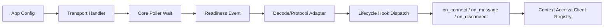

# Architecture

## Purpose

This document captures:

- The current implementation architecture in this repository.
- The target architecture defined in [docs/requirement.md](../docs/requirement.md).
- The gaps that must be closed for requirement alignment.

## Scope

Current implementation focus:

- TCP server/client lifecycle and message handling.
- Shared socket abstraction and registry utilities.
- Type-state constrained API transitions.

Current known limitation:

- Transport support in this branch is TCP-focused.

## Architecture Principles

- Sync-first core (no embedded async runtime).
- Layered separation between platform core, transport handlers, and user callbacks.
- Type-state API safety for server/client lifecycle transitions.
- Framework-owned client metadata kept separate from user-owned session state.

## Layered Design

### Layer 1: Core platform and primitives

Primary modules:

- `src/core/socket`
- `src/core/models`
- `src/core/registry`

Responsibilities:

- Platform-specific socket operations hidden behind shared abstractions.
- Domain models for server/client/context state.
- Client registry for active connection metadata.

Target expansion from requirements:

- Add a unified poller abstraction with platform backends:
    - Linux: epoll
    - macOS: kqueue
    - Windows: WSAPoll
- Keep socket and poller errors mapped through consistent core error types.

### Layer 2: Transport handler layer

Primary modules:

- `src/tcp_socket_handler/server`
- `src/tcp_socket_handler/client`
- `src/tcp_socket_handler/errors.rs`

Responsibilities:

- Public server and client lifecycle APIs.
- Type-state transitions:
    - Server: `Created -> Listening`
    - Client: `Disconnected -> Connected`
- Connection and session coordination.
- Dispatch of transport events into user callbacks.

Target expansion from requirements:

- Formalize lifecycle hooks:
    - `on_connect(client, context)`
    - `on_message(client, context, payload)` for TCP
    - `on_disconnect(client, context, reason)`
- Introduce protocol adapter/codec integration points.

### Layer 3: User callback and protocol layer

Current behavior:

- Message callback (`OnMessageHandler`) drives application behavior.
- Context-level helpers can be used by handlers.

Target expansion from requirements:

- Keep callback contracts stable and transport-agnostic.
- Add pluggable codec interfaces for custom L7 framing/encoding.
- Keep pub-sub and other higher-level protocols outside L4 core.

## Module Map

- `src/lib.rs`: crate module exports.
- `src/core`: socket abstraction, domain types, registries.
- `src/tcp_socket_handler/server`: server lifecycle and session runtime.
- `src/tcp_socket_handler/client`: connected/disconnected client APIs.
- `src/tcp_socket_handler/errors.rs`: TCP-specific error model.
- `src/server_module/main.rs`: repository example server binary.
- `integration_tests`: integration test crate for end-to-end behavior.

## Runtime Flows

### Current TCP flow (implemented)

### Target event flow (requirement-aligned)

## Type-State Guarantees

- You cannot call `run` before `into_listening`.
- You cannot call `send` or `receive` before `connect`.

These constraints remain part of the stable public API design.

## Concurrency and Execution Model

### Current implementation

- Server accepts each connection in a loop.
- A dedicated thread is spawned per accepted client session.
- Session loop reads payloads and invokes `OnMessageHandler`.
- Client sessions are removed from registry on disconnect or read failure.

### Target model from requirements

- Poller-driven event loop is the primary execution model.
- Callback hooks execute synchronously from the event path.
- Callback logic is expected to be short-running and non-blocking.

## Registry and Context Boundaries

- Client registry: framework-owned connection metadata.
- Context: the callback-facing boundary that exposes registry and server state.

Session registry is not yet implemented.

## Alignment Status

Aligned now:

- Layered architecture framing (core, handler, callback).
- Type-state lifecycle constraints for TCP server/client APIs.
- Client registry concepts.

In progress or missing versus requirements:

- Poller abstraction and backend implementations (epoll/kqueue/WSAPoll) are not yet documented as implemented in this repository.
- Lifecycle hooks are partially represented by message handling; explicit `on_connect` and `on_disconnect` contract shape needs full alignment.
- Codec/protocol adapter layer is not yet represented as a stable public API.
